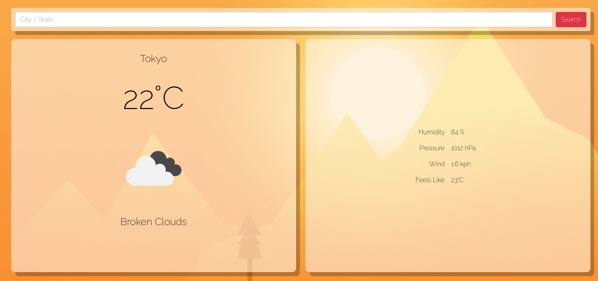
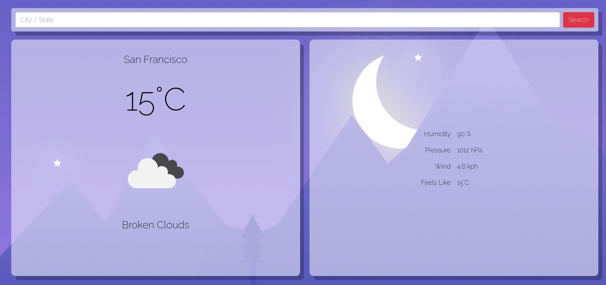
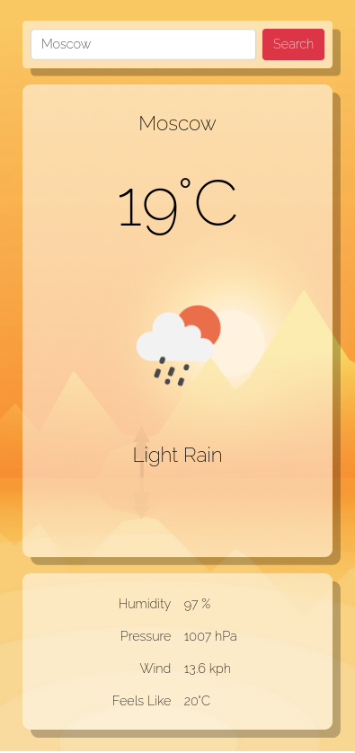
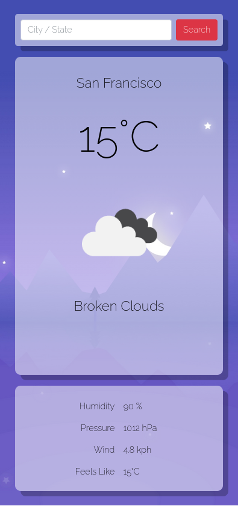

# blue-sky

A simple, responsive, realtime, current location based weather application

#

 

#

#### Website
https://blue-sky-1.herokuapp.com/

#### External APIs used
* https://extreme-ip-lookup.com/json/
* https://openweathermap.org/

#### How to use
* Get an api key from https://openweathermap.org/
* Paste the api key in _appid_ of _credentials.py_ 